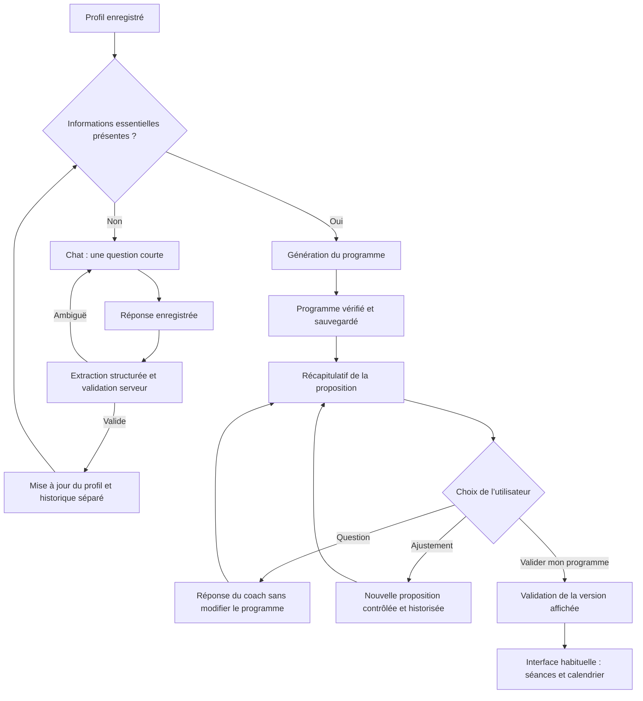
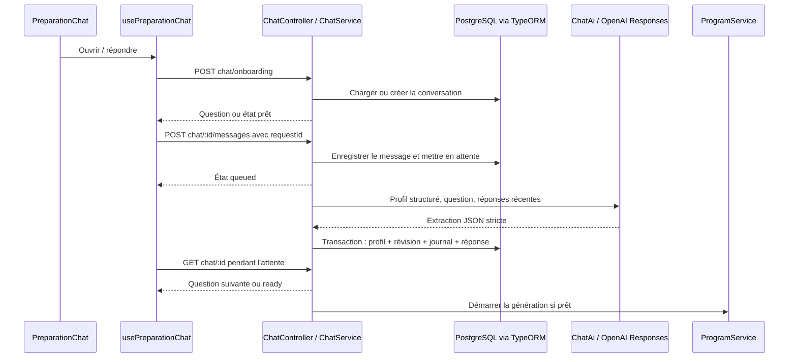

# Chat de préparation du programme

Le même composant de bulles et le même champ de saisie servent au coach existant
et à la préparation. Le backend conserve une conversation par utilisateur et par
usage (`onboarding` pour les informations manquantes, `program_review` pour discuter de la proposition). Le chat quotidien reste une prochaine intégration : ses
réponses de démonstration ne passent pas encore par ce backend.

## Parcours utilisateur

Le prénom Apple est enregistré lorsqu'il est fourni. Apple ne le renvoie pas
nécessairement aux connexions suivantes ; le chat le demande uniquement s'il
manque. Les champs recherchés sont le prénom, les disponibilités, le matériel,
les contraintes de club et les précisions indispensables demandées par le générateur.
Une douleur déclarée reste conservée ; le chat ne délivre aucune autorisation
médicale et ne débloque pas automatiquement la génération dans ce cas.

Quatre séances signifient quatre séances **au total**, par exemple deux de boxe
et deux de musculation. Le coach organise les jours libres. Si les cours du club
sont fixes, il demande leurs jours et respecte leur durée lorsqu'elle est connue.
Les séances de musculation utilisent les exercices de l'API publique wger ; les
autres sports utilisent des blocs avec durée, intensité et consigne courte.

## Parcours du code

`projectAnswer` autorise uniquement les champs correspondant à la question posée.
Les réponses structurées ne sont jamais appliquées directement au compte.
Les champs métier gardent leur ligne ; chaque correction conserve avant/après,
message source, date, réponse structurée IA et référence fournisseur dans le journal.
`onboardings.coaching_details` conserve les contraintes complémentaires sans être
écrasé par une sauvegarde du formulaire classique.

Les messages sont immuables en base (trigger UPDATE/DELETE), les tentatives réseau
sont dédupliquées par UUID. Un worker avec bail de 90 secondes reprend les tâches
interrompues ; son identifiant empêche un ancien worker de publier après reprise.
Une réponse liée à une ancienne révision du profil est écartée. Trois reprises
automatiques maximum ; les erreurs restent réessayables avec le même message.
Le serveur déclenche la génération même si le mobile se ferme pendant la réponse.

## Configuration et vérification

Appliquer `cd api && npm run migration:run` pour la migration
`1790200000000-CoachingChat`, puis redémarrer l'API. Aucun nouveau module natif
mobile n'est ajouté par ce lot. Le prénom nécessite de tester une première
connexion Apple ; le parcours de secours fonctionne aussi avec les anciens comptes.

`OPENAI_API_KEY` reste exclusivement côté serveur. L’extraction des réponses est configurable via
`OPENAI_ONBOARDING_MODEL`, avec le défaut `gpt-5.6-luna` et effort `low`. Le chat de révision utilise Terra/medium (`OPENAI_REVIEW_MODEL`) et les modifications de programme Sol/high (`OPENAI_PROGRAM_MODEL`). Leur disponibilité
sur le compte reste à valider lors du premier essai réel. Aucun appel OpenAI réel
n'est effectué dans les tests.

Tests : `cd api && npm test`, puis dans `mobile`, `./node_modules/.bin/tsc --noEmit`
et `node --experimental-strip-types --test tests/onboarding.test.cjs tests/program.test.cjs`.
Ils couvrent les corrections historisées, l'isolation des comptes, les doublons,
les reprises, les révisions obsolètes, les contraintes multisport et le rendu métier
des séances libres. Le test tactile complet sur iPhone reste manuel.

## Discussion de la proposition et validation

`ProgramProposal` affiche le récapitulatif et le chat de revue dans l'onboarding
et sur `/program` tant que `acceptedAt` est nul. Après validation,
`GeneratedProgramScreen` affiche `ProgramScreen` / `ProgramOverview` avec les
vraies séances, durées, jours, nombres d'exercices et prescriptions.
L'ancienne interface reste la vue quotidienne ; le récapitulatif n'est pas
l'écran principal du programme actif. La validation dans l'onboarding ouvre `/program`.

Le chat distingue une question (réponse courte sans modification) d'une demande
explicite d'ajustement. L'ajustement repasse par `ProgramGenerator`, son catalogue
wger et ses validations. Il garde les contraintes du profil et les autres séances.
Si la demande implique de changer les disponibilités ou les sports sélectionnés,
le coach invite à corriger le profil. Une révision impossible ou un appel échoué
ne détruit pas la proposition existante. Aucune réponse IA ne valide le programme.

- `POST /api/program-review` ouvre/reprend le chat.
- `GET /api/chat/:id` consulte les messages et l'état persistant.
- `POST /api/program-review/:id/messages` reçoit `requestId`, `proposalId`, `text`.
- `POST /api/program/accept` reçoit `proposalId` et renvoie `acceptedAt`.

Les révisions changent `proposalId` (le `runId` du programme), sans créer de nouvelle
ligne métier. Avant/après et identifiants des propositions sont conservés dans le
journal. La validation est idempotente et vérifie la révision du profil, la version
affichée et l'absence de réponse en cours. Une réponse tardive ne peut modifier une
proposition déjà validée ou remplacée. Les messages restent immuables et les retries
utilisent le même UUID. La reprise de la revue utilise un bail de 480 secondes,
avec un délai maximal de génération de 420 secondes incluant la classification.

Migration `1790300000000-ProgramAcceptance` : `accepted_at` sur le programme,
`program_run_id` sur la conversation. Les anciens programmes ne sont pas validés
automatiquement : l'utilisateur les confirme une fois. Appliquer la migration
et redémarrer l'API ; aucun nouveau module natif n'impose un rebuild mobile.

Le schéma de réponse du chat utilise le format JSON strict de la
[documentation OpenAI Structured Outputs](https://developers.openai.com/api/docs/guides/structured-outputs).
Les tests simulés vérifient le contrat et les états ; ils ne mesurent pas la qualité
des réponses du modèle réel. Le chat quotidien reste un chantier distinct.

### Présentation du chat de revue

« Discuter avec mon coach » ouvre un drawer (`BottomSheet`). Les messages
défilent dans son contenu ; le champ reste dans son footer, avec adaptation au
clavier et à la zone sûre. La fermeture conserve le brouillon et la discussion.
« Valider mon programme » reste sur le récapitulatif. La barre de navigation
partagée disparaît pendant l’affichage du clavier.

## Ton du coach

`api/src/ai/coach-voice.ts` partage les consignes et exemples entre onboarding, discussion et génération. Par défaut : un SMS de 5 à 25 mots, deux petites phrases et 40 mots au maximum si nécessaire. Une demande explicite de détails autorise une réponse plus longue. Le champ de réponse du chat programme accepte jusqu’à 1 600 caractères pour cette exception ; cette limite est un plafond, pas une longueur cible. Les réponses d’onboarding restent limitées à 180 caractères. Les anciens messages ne sont pas réécrits. Les tests simulés ne prouvent pas le respect stylistique par le modèle réel.
