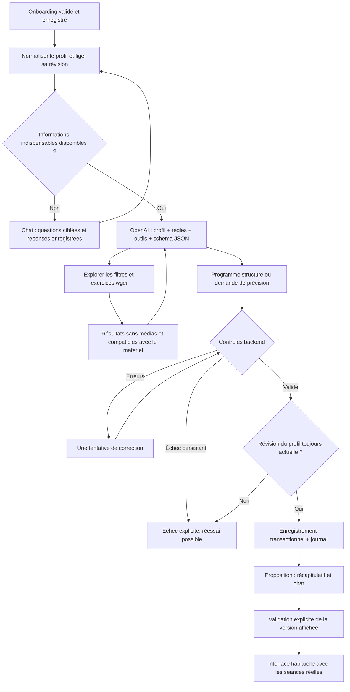

# Génération du programme après l’onboarding

## Périmètre livré

L’API publique **https://wger.de/api/v2/** est la seule source d’exercices.
Aucune instance wger, aucun Docker wger, aucune copie complète de son catalogue.
Un cache mémoire de 15 minutes (150 requêtes maximum) accélère les lectures.
Les images/vidéos et URLs des images musculaires ne sont pas conservées ni envoyées
au modèle. Seules les fiches utilisées dans le programme sont figées avec leur
provenance, auteurs et licences pour assurer la stabilité de l’historique.

Le programme couvre tous les sports sélectionnés dans un budget total de séances :
bloc de quatre semaines, première semaine détaillée, progression conditionnelle.
Le coach choisit les jours libres et respecte les cours fixes précisés dans le chat.
La musculation utilise wger ; les autres sports utilisent des blocs chronométrés. Pas de calcul nutritionnel, de diagnostic,
de charge initiale en kg ni de génération à partir des photos dans ce lot.
La consultation du programme et la préparation des séances utilisent les données
générées. Les écrans existants de séance sont conservés ; leurs saisies de séries
restent en mémoire, comme indiqué avant démarrage. Leur persistance et
l’adaptation hebdomadaire restent un lot distinct. Les remplacements et analyses
du coach de démonstration ne sont pas proposés sur les séances générées.

## Parcours de décision



Ce schéma représente l’orchestration et les décisions observables, pas un accès
au raisonnement privé du modèle. Les étapes du loader correspondent aux états
serveur et peuvent revenir à la recherche pendant une exploration ou correction.
Aucun pourcentage arbitraire ni validation visuelle simulée.

## Parcours du code

```mermaid
sequenceDiagram
  participant UI as OnboardingScreen / GeneratedProgramScreen
  participant H as useTrainingProgram
  participant API as ProgramController
  participant DB as PostgreSQL / TypeORM
  participant W as ProgramService worker
  participant G as ProgramGenerator
  participant O as OpenAI Responses
  participant E as WgerService
  participant WG as wger.de public
  UI->>H: Fin onboarding / consulter / réessayer
  H->>API: POST /program/generate
  API->>DB: Verrou profil + même ligne training_programs + journal
  API-->>H: queued
  W->>DB: Réserver le travail avec bail
  W->>G: Contexte figé, signal d’annulation, callback phase
  G->>O: Instructions + profil + rules + tools + text.format
  loop Exploration bornée
    O-->>G: function_call
    G->>E: Filtres, recherche ou détails
    E->>WG: GET sans informations utilisateur
    WG-->>E: JSON public
    E-->>G: Fiches filtrées sans médias
    G->>O: function_call_output + contexte de conversation
  end
  O-->>G: JSON conforme au schéma
  G->>G: Validation Zod + règles métier ; une réparation maximum
  G-->>W: Programme + fiches sources + trace technique
  W->>DB: Vérifier runId et révision, UPDATE + journal
  loop Tant que queued ou generating
    H->>API: GET /program toutes les 2,5 secondes
    API-->>H: phase / résultat / erreur
  end
  H-->>UI: Programme persistant
```

## Fichiers

- `api/src/program/context.ts` : conversions de nombres/unité, étapes ignorées,
  matériel autorisé, données manquantes. Aucune photo, email ni identifiant Apple.
- `wger.service.ts` : origine HTTPS fixe, délais de 15 s, cache, pagination,
  préférence français puis anglais, métadonnées de licence et auteur.
- `generator.ts` : prompt versionné, quatre outils, boucle Responses HTTP,
  `store: false`, conservation des éléments de reasoning chiffrés entre appels,
  refus/réponses incomplètes explicites. Modèle configuré via `OPENAI_PROGRAM_MODEL`,
  défaut `gpt-5.6-sol`, effort `high` (génération et ajustements).
- `program.schema.ts` : schéma Zod strict et JSON Schema transmis dans
  `text.format` avec `strict: true`. La forme du résultat n’est pas une preuve
  de qualité sportive.
- `validation.ts` : références consultées, équipement, jours, séries, répétitions,
  durée avec repos/échauffement/transitions. Référentiel initial versionné,
  à évaluer avec un coach ; il ne constitue pas une validation médicale.
- `program.service.ts` : persistance, idempotence par révision, worker, bail,
  protection des résultats périmés et journal transactionnel.
- `program.controller.ts` : routes protégées par la session ; aucun userId libre.
- `mobile/src/hooks/useTrainingProgram.ts` : chargement, démarrage, polling sans
  chevauchement, isolation par compte, rechargement au retour sur l’écran, annulation logique au démontage.
- `mobile/src/components/TrainingProgramView/` : état serveur, erreurs,
  clarifications, séances et attribution des exercices. Composant partagé.
- `mobile/src/features/program/screens/GeneratedProgramScreen.tsx` : consultation.

## Outils donnés au modèle

| Outil | Entrée | Résultat |
| --- | --- | --- |
| `get_training_context` | objet vide | Même contexte figé et règles que dans le premier appel |
| `get_exercise_filters` | objet vide | Catégories, matériel, muscles et leurs identifiants |
| `search_exercises` | categoryId, equipmentId, muscleId (null autorisé), offset | Page de 20 fiches avant filtrage, nextOffset |
| `get_exercise_details` | 1 à 8 identifiants | Fiches compatibles |

Les paramètres sont validés côté serveur, même en mode strict OpenAI. Une page
vide après filtrage peut avoir une page suivante. Les URLs de pagination wger ne
sont jamais suivies directement ; le serveur reconstruit une URL de l’origine fixe.
Une fiche sans matériel explicite est exclue (information inconnue). Les items
non reconnus du formulaire restent explicitement inconnus. Une salle déclarée
« complète » sans sélection précise autorise le matériel standard du catalogue ;
cette hypothèse est transmise et doit être expliquée à l’utilisateur.

## Fiabilité et historique

- Une ligne `training_programs` par utilisateur ; les relances/corrections la
  mettent à jour. Le journal conserve les versions avant/après, contexte utilisé,
  modèle, version de prompt/règles, outils appelés et résultat final.
- POST répété pour la même révision renvoie le travail existant. `retry: true`
  relance seulement un échec ; un programme prêt n’est pas régénéré par double clic.
- Worker intégré NestJS, un travail simultané par processus. Réservation PostgreSQL
  `FOR UPDATE SKIP LOCKED`, bail de 120 s renouvelé toutes les 20 s. Reprise d’un
  bail expiré, trois prises en charge maximum avant échec visible.
- `runId` empêche un ancien worker de publier sur une relance récente. La révision
  du profil est revérifiée dans la transaction de publication.
- Maximum 10 appels modèle, 20 outils, 1 correction et 6 minutes par travail.
  Chaque appel OpenAI a un délai de 90 s. Un arrêt brutal peut conduire à refaire
  un appel externe à la reprise ; la publication locale reste protégée.
- Aucune clé : réponse HTTP 503 explicite, profil conservé, aucune fausse réussite.
- Disponibilités/matériel ignorés : demande de compléter le profil. Douleur déclarée :
  clarification et orientation vers un professionnel ; cette version ne possède
  pas encore de formulaire de restrictions validées médicalement.

## Configuration et vérification

Ajouter `OPENAI_API_KEY` uniquement dans `api/.env` (ou `.env.local`, prioritaire),
puis redémarrer l’API. Ne jamais utiliser une variable `EXPO_PUBLIC_` pour la clé.
`OPENAI_PROGRAM_MODEL`, `OPENAI_REVIEW_MODEL` et `OPENAI_ONBOARDING_MODEL` sont optionnels. Leurs défauts sont respectivement Sol/high, Terra/medium et Luna/low. L’ancienne variable `OPENAI_MODEL` est ignorée. Astra est exclu des modèles autorisés. L’accès réel au modèle dépend du projet OpenAI.

```sh
cd api
npm run migration:run
npm test
cd ../mobile
./node_modules/.bin/tsc --noEmit
npm run test:onboarding
```

Les tests OpenAI sont simulés : ils vérifient le contrat d’échange et les erreurs,
mais pas la qualité d’un programme réellement généré. Avant mise en production,
faire une génération réelle et une évaluation sur plusieurs profils avec un coach.
Les tests TypeORM/PGlite couvrent les migrations, l’idempotence, l’historique,
les reprises et le rejet d’un résultat périmé. Les essais multi-processus réels et
la vérification visuelle sur iPhone restent des contrôles complémentaires.

Sources techniques :
- https://wger.readthedocs.io/en/latest/api/api.html
- https://developers.openai.com/api/docs/guides/function-calling
- https://developers.openai.com/api/docs/guides/structured-outputs

Le chat de préparation, ses garanties de persistance et son parcours de code sont
détaillés dans [onboarding-chat.md](onboarding-chat.md).
